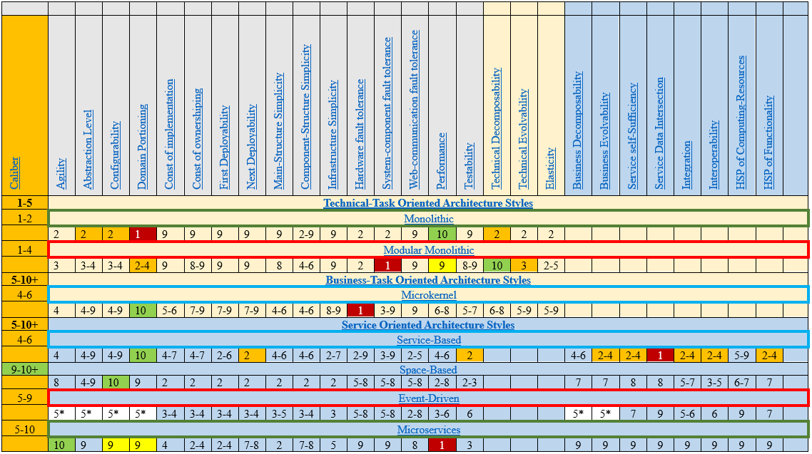

# Анализ архитектурных стилей: часть №1/9: сравнительная таблица

# Введение
Это первая часть цикла из 9-ти статей, посвящённых сравнительному анализу существующих архитектурных стилей разработки ПО.
***
В данной статье будет дано общее описание сравнительной таблицы по двум пунктам:
(1) правила выставления оценок,
(2) описание характеристик.

Все последующие статьи будут опираться на текущую как на базисную и будут посвящены детальному сравнению конкретного архитектурного стиля.

## Правила выставления оценок
* **таблица не содержит абсолютных оценок: все оценки относительные!**
* если по какому-либо из показателей два и более архитектурных стиля имеют одинаковые значения, значит различия  незначительны;
* каждый показатель оценивается от 1 до 10;
* если показатель оценен как 9 или 10, то ему обязательно будет дано подробное описание в разделе <ins>«ключевые сильные стороны»</ins> для соответствующего архитектурного стиля;
* если показатель оценен как 1 или 2, то ему обязательно будет дано подробное описание в разделе <ins>«ключевые слабые стороны»</ins> для соответствующего архитектурного стиля;
* если показатель оценен в диапазоне от 3 до 8, то подробное описание будет дано только в случае наличия необходимых к раскрытию нюансов;
* каждый показатель может быть оценён в диапазоне (например 3-6): подобное означает, что показатель существенно зависит от области знаний и/или сферы бизнеса в котором применяется соответствующий архитектурный стиль, и/или от конкретной реализации системы:
* * если показатель попадает в диапазон 2-[3; 8], то подробное описание будет дано наихудшей ситуации (2);
* * если показатель попадает в диапазон [3-8]-9, то подробное описание будет дано наилучшей ситуации (9);
* * если показатель оценен как 2-9, то в зависимости от стиля подобное описание будет дано в любой из колонок, но с обязательным объяснением наихудшего и наилучшего случаев;
* каждый архитектурный стиль может и должен иметь оценку 10 только по одному показателю:
* * если архитектурный стиль имеет оценку 10, окрашенную в зелёный цвет, по какому-либо из показателей, значит он лучший по данному показателю в сравнении с любым другим, представленным в таблице, архитектурным стилем и именно для него данное качество является эталонным;
* если архитектурный стиль имеет оценку 9, окрашенную в жёлтый цвет, по какому-либо из показателей, значит именно по данному показателю стиль является наиболее удачным в сравнении с другими своими показателями и лишь немного не дотягивает до первенства в абсолютном сравнении;
* каждый архитектурный стиль может и должен иметь оценку 1 только по одному показателю:
* * если архитектурный стиль имеет оценку 1, окрашенную в красный цвет, по какому-либо из показателей, значит от худший по данному показателю в сравнении с любым другим, представленным в таблице, архитектурным стилем;
* если архитектурный стиль имеет оценку 2, окрашенную в оранжевый цвет, по какому-либо из показателей, то это означает что при разработке следующего по эволюции архитектурного стиля, архитекторы делали акцент на исправлении именно этого показателя;
* если два и более названия архитектурных стиля обрамлены в одинаковую рамку, то подобное означает, что нижележащий стиль идеологически и концептуально базируется на вышележащем;
* отдельным показателем является первая колонка Caliber.

## Описание характеристик
| ⚠ Заметка |
|-|
| 1. Когда употребляется слово **«качество»** относительно какой-то характеристики рассматриваемого архитектурного стиля, то имеется в виду тот факт, что независимо от специфики/тематики/области знаний/сложности ПО, написанного в концепции рассматриваемого стиля, указанная характеристика не может быть не соблюдена (т.е. нельзя спроектировать ПО таким образом, чтобы данная характеристика была испорчена).|
| 2. Когда употребляется слово **«способность»** относительно какой-то характеристики архитектурного стиля, то имеется в виду тот факт, что сам по себе архитектурный стиль не гарантирует, но лишь способствует (не препятствует) созданию ПО, архитектура которого будет обладать указанной характеристикой (т.е. в условиях реальной разработки ПО, даже при использовании рассматриваемого архитектурного стиля, указанная характеристика может быть испорчена). |

| ✔ Определение |
|-|
|1.	**Задача** – что-то, требующее решения с использованием ПО, запущенного на вычислительном оборудовании.
|2.	**Техническая задача (ТЗ)** – это задача, доступная к определению через строго формулируемые технические требования, и характеризующая следующими факторами:    * контекст её формулировки относится к одной области знаний и/или, одной специфики решения, и/или одному подходу к своему решению;   * скорее важны результаты, а не промежуточные состояния и контекст решения:   * * набор входных данных необходимый для её решения, всегда заранее определён;   * * набор выходных данных, являющихся результатом решения всегда заранее определён. |
|3.	**Бизнес-задача (БЗ)** – это задача, для комплексного решения которой необходимо решить две и более технические задачи в рамках и по заранее определённой процедуре сорганизованного обмена результатами вычислений, и характеризующаяся следующими факторами:   * контекст её формулировки относился к некоторой абстрактной сфере (человеческих коммуникаций, межкомпонентного взаимодействия и т.д.);   * скорее важен контекст и процесс решения, а не итоговые результаты:   * * набор входных данных заранее не определён и может меняться по ходу решения задачи;   * * набор выходных данных заранее не фиксирован и может меняться по ходу решения задачи, имея промежуточные результаты. |

***
### Caliber
Масштаб задач, для которых данный архитектурный стиль подходит наиболее хорошо:
* показатели от 1 до 5 свидетельствуют о том, что данный архитектурный стиль ориентирован на создание приложений решающих ТЗ:
* * оценка 1 свидетельствует о том, что архитектурный стиль наиболее подходит для решения строго сформулированной, однозначно понимаемой задачи;
* * оценка 5 свидетельствует о том, что архитектурный стиль наиболее подход для решения комплекса задач из одной области знаний, или одной специфики, или согласованных с одним подходом к своему решению, или общей для всех логики решения;
* показатели от 6 до 10 свидетельствуют о том, что данный архитектурный стиль ориентирован на создание приложений решающий БЗ;
* * чем больше оценка тем масштабнее решаемая бизнес-задача.

***
### Agility
Способность архитектуры ПО быстро адаптироваться под постоянно меняющиеся бизнес-требования, обеспечивая гарантию сохранности удовлетворения функциональных и нефункциональных требований.

***
### Abstraction Level
Способность архитектуры ПО скрывать технические детали своей реализации.

***
### Configurability
Способность архитектуры ПО гибко адаптироваться под конкретные задачи/запросы/действия своих пользователей.

***
### Domain portioning
Способность архитектуры ПО быть хорошо декомпозируемой на изолированные по роли компоненты.

***
### Cost of implementation
Качество архитектуры ПО быть дешёвой на этапе реализации.

***
### Const of ownershiping
Качество архитектуры ПО быть дешёвой на этапе владения.

***
### First Deployability
Качество архитектуры ПО быть максимально простой на этапе ввода в эксплуатацию.

***
### Next Deployability
Качество архитектуры ПО быть максимально простой на этапе сопровождения/обновления/поддержки.

***
### Main-Structure Simplicity
Способность архитектуры ПО быть максимально простой в контексте общей архитектуры.

***
### Component-Structure Simplicity
Способность архитектуры ПО быть максимально простой в контексте архитектуры локальных компонентов.

***
### Infrastructure Simplicity
Качество архитектуры ПО быть максимально простой в контексте требований к обеспечивающей инфраструктуре.

***
### Hardware fault tolerance
Качество архитектуры ПО быть устойчивой к аппаратным сбоям.

***
### System-component fault tolerance
Качество архитектуры ПО быть устойчивой к внутренним/собственным/системным сбоям.

***
### Web-communication fault tolerance
Качество архитектуры ПО быть устойчивой к сбоям в работе сети.

***
### Performance
Качество архитектуры ПО быть максимально производительной насколько это возможно в сравнении с доступными решениями/реализациями.

***
### Testability
Качество архитектуры ПО быть легко поддающейся отладочному тестированию.

***
### Technical Decomposability
Способность архитектуры ПО быть хорошо декомпозируемой на компоненты независимые по технической роле:
1)	UI – роль интерфейса пользователя;
2)	DB – роль базы данных;
3)	Controller – роль логики системы;
4)	Security – роль защиты информации;
5)	и другие роли, в зависимости от ПО.

***
### Technical Evolvability
Способность архитектуры ПО быть хорошо адаптируемой к будущим изменениям в технических запросах/задачах, решаемых системой.

***
### Elasticity
Способность архитектуры ПО быть хорошо адаптируемой к использованию аппаратных ресурсов в зависимости от реальной моментальной нагрузки без прерывания функционирования.

***
### Business Decomposability
Способность сервис-ориентированной архитектуры ПО быть хорошо декомпозируемой на компоненты независимые по бизнес-роли (Security, Validation, User Orchestration, …).

***
### Business Evolvability
Способность сервис-ориентированной архитектуры ПО быть хорошо адаптируемой к будущим изменениям в бизнес-запросах/задачах, решаемых системой.

***
### Service self-Sufficiency
Способность сервис-ориентированной архитектуры ПО наделять составные компоненты общей системы максимальной независимостью друг от друга.

***
### Service Data Intersection
Способность сервис-ориентированной архитектуры ПО максимально разделять данные необходимые для работы отдельных компонентов.

***
### Integration
Способность сервис-ориентированной архитектуры ПО легко и просто интегрировать новые компоненты, улучшая тем самым свойства системы.

***
### Interoperability
Способность сервис-ориентированной архитектуры ПО быть легко и просто адаптируемой для предоставления и получения данные от других систем в процессе кооперационного взаимодействия.

***
### Horizontal Scaling Possibility of Computing-Resources
Способность сервис-ориентированной архитектуры ПО наращивать вычислительную мощность путём дублирования сервисов.

***
### Horizontal Scaling Possibility of Functionality
Способность сервис-ориентированной архитектуры ПО добавлять новый функционал путём добавления новых сервисов.

# Заключение
Представленная сравнительная таблица содержит большое количество информации, включая ту, которая передана через различные стилистические приёмы (цвет, подчёркивание...), каковая будет учитываться и объясняться по мере выхода статей посвящённых детальному разбору конкретного архитектурного стиля.
По факту выхода 8-ой статьи, в заключительной 9-ой статье, автором будут высказаны некоторые интересные наблюдения и умозаключения относительно текущей ситуации в сфере архитектуры ПО и предложен ряд концептуальных приёмов при выборе архитектуры.

***
Следующая статья (2/9) будет посвящена детальному описанию архитектурного стиля **Monolithic**.

# Заметки:
Статьи будут выходить примерно раз неделю.
Подписывайтесь на мой ТГ канал - [t.me/TopITBlog](https://t.me/TopITBlog) - посвященный архитектуре ПО:
- там даны ссылки на источники и на документ с уже готовым материалом;
- учитывая, что развитие архитектуры ПО, процесс довольно неспешный, материалы в данном канале будут выходить редко (чаще обновляясь), а автор в свою очередь обязуется следить за актуальность уже представленной информации.